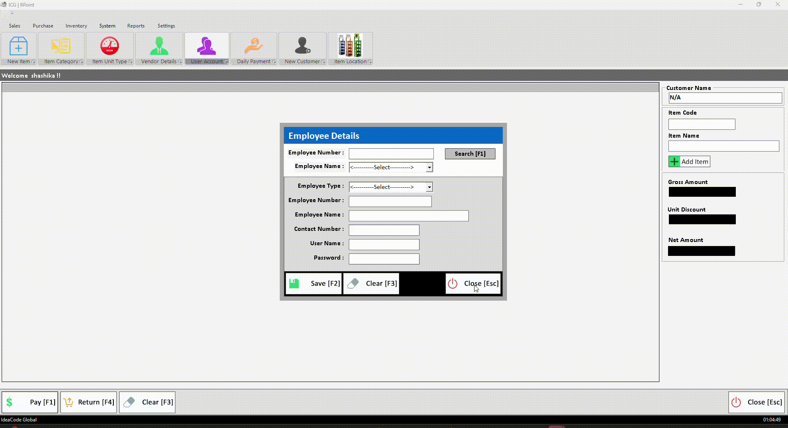

# Point of Sale (POS) System

A complete Point of Sale (POS) system built with C# for Windows with SQL Server as the database. This system provides a comprehensive set of features designed to streamline sales, inventory, and payment processes in a retail environment.

## Features

- **Intuitive User Interface**: Designed with user-friendly screens and navigation menus for smooth interaction.
- **Shortcut Keys**: Quick access to frequently used operations.
- **Full-Screen Mode**: Option to run the application in full screen for better usability.

### Core Functionalities

1. **Authentication and User Management**

   - Login screen with secure access for authorized users.
   - Change password feature for enhanced security.
   - Role-based access and permissions.

2. **Customizable Settings**

   - Customize company details such as name, address, contact, and logo.
   - Database backup option for instant and on-demand backups.

3. **Inventory Management**
   - Real-time inventory tracking with item low-stock notifications.
   - Stock adjustments and detailed inventory reports.
4. **Sales Module**

   - Multiple payment options including Cash, Cheque, Credit, Easy Payment, Gift Vouchers, and Returns.
   - Dedicated Sales and Sales Return screens.
   - Credit payment and easy payment support for flexible payment handling.

5. **Purchasing Module**

   - Item purchasing, purchase returns, and credit payments.
   - Stock entry upon item purchase.
   - Tracking of supplier transactions and return processes.

6. **Reports**

   - A variety of reports to support business insights and decision-making:

     - **Sales Reports**
       - Sales Summary
       - Sales Items Details
       - Sales Return Summary
       - Invoice Summary
       - Cheque Details
       - Gift Voucher Details
     - **Purchase Reports**
       - Purchase Summary
       - Purchase Detail
       - Credit Cash Payment
       - Credit Cheque Payment
       - Cheque Payment Report
     - **Inventory Reports**

       - Inventory Detail
       - Inventory Change Report
       - Stock Adjustment Details
       - Item Serial Numbers

     - **Credit Reports**
       - Credit Detail
       - Credit Summary
       - Credit Payment via Cash
       - Credit Payment via Cheque
     - **Other Reports**
       - Customer Report
       - Vendor Report
       - Daily Income Report
       - Advance Payment Report
       - Easy Payment Report

### Screens and Modules

#### **1. Login and Navigation**

- **Login Screen**: Secure login with user credentials.
- **Navigation Menus**: Easily navigate through the application using structured menus and shortcut keys.

#### **2. Sales Module**

- **Sales Screen**: Enter sales data, process payments, and manage customer interactions.
- **Sales Return**: Process sales returns with complete record tracking.
- **Credit Payment & Easy Payment**: Options for handling partial and deferred payments.

#### **3. Purchase Module**

- **Item Purchase**: Record purchase details and update inventory.
- **Purchase Return**: Track and manage return transactions.
- **Credit Payment**: Support for credit-based purchases.

#### **4. Inventory Module**

- **Item Inventory**: Monitor and update stock levels.
- **Stock Adjustments**: Adjust stock manually and track changes with detailed reporting.

#### **5. Reports Module**

Generate detailed reports for Sales, Purchases, Inventory, and Credit to gain insights into business performance.

## Technical Requirements

- **Platform**: Windows
- **Programming Language**: C#
- **Database**: SQL Server

## Regards - Shashika Hettiarachchi ❤️
